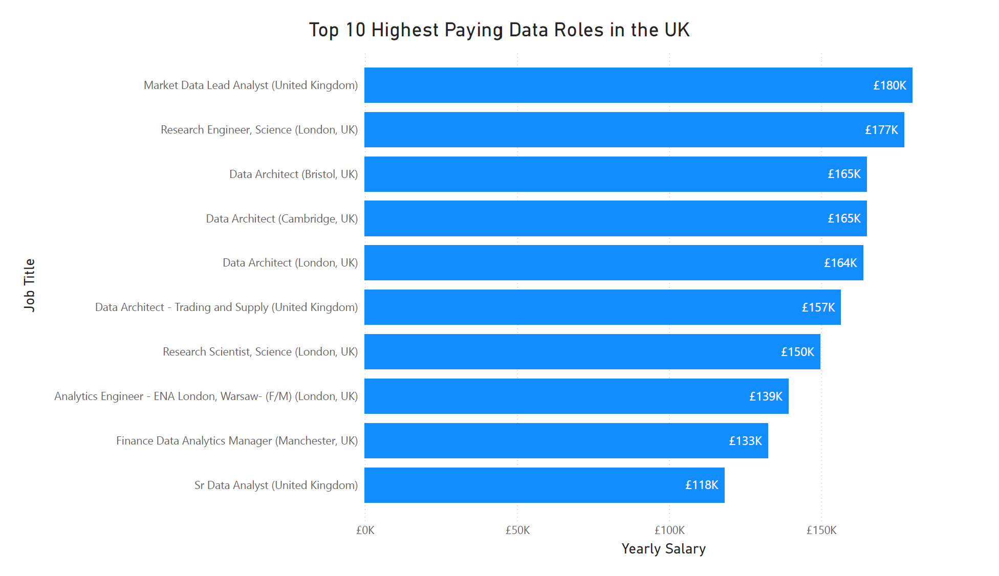
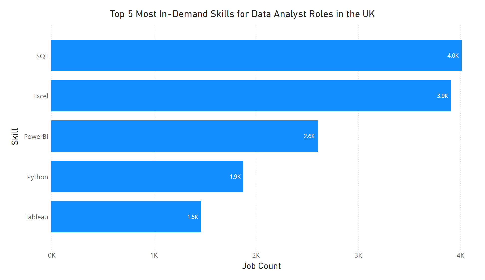
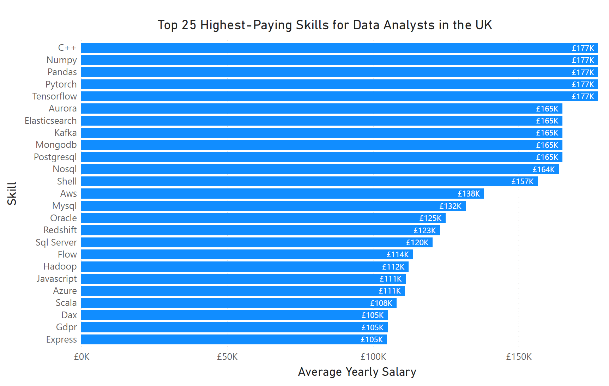
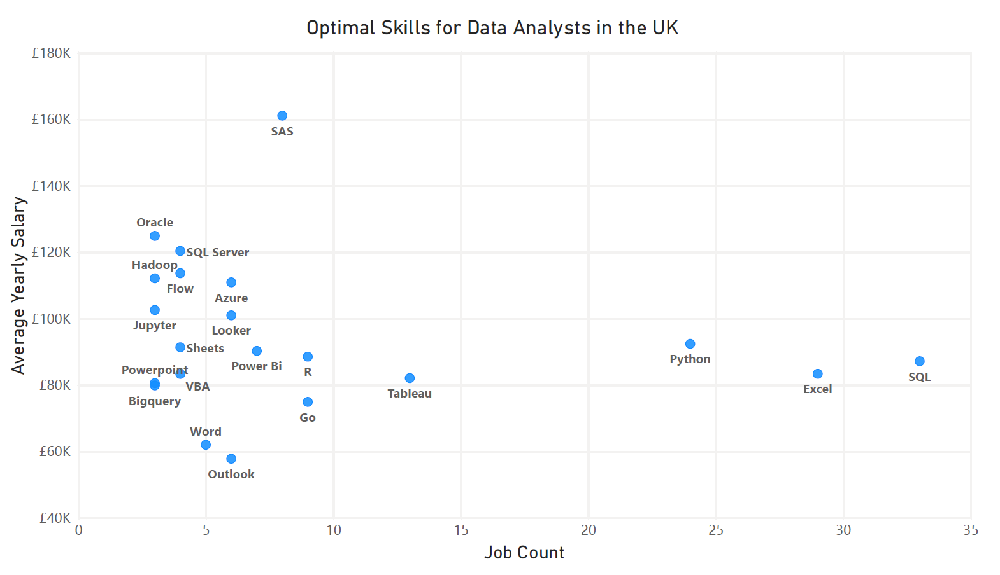

# Introduction
This project takes a deep dive into the UK data job market, with a spotlight on Data Analyst roles. The goal is to uncover which jobs offer the highest salaries, which skills are most in demand, and most importantly where those two factors intersect. By analyzing job postings and market trends, the project reveals not just what’s paying well but also which skills can unlock the best opportunities for data professionals looking to grow their careers in the UK.

You can follow the following link to see the SQL behind the analysis: [project_sql folder](/project_sql/)

# Background
I undertook this project to make it easier for others who are looking to break into or advance within the UK data job market. With so many potential career paths and technical skills to choose from, it can be difficult to know where to focus your efforts. This analysis is designed to highlight which skills are truly in demand, and which ones can provide the best opportunities for upskilling in order to secure data roles in the UK.

The dataset used for this work comes from a [SQL course](https://lukebarousse.com/sql) that I completed, providing a structured foundation for querying, analyzing, and drawing insights from job market data.

### The questions I wanted to answer with this SQL project were:

1. What are the highest-paying data analyst jobs in the UK?
2. What skills are required for these high-paying jobs?
3. What skills are most in demand for data analysts in the UK?
4. Which skills are associated with higher salaries in the UK?
5. What are the most optimal skills to leaern for the UK data job market?
# Tools I Used
To carry out this project, I relied on a combination of database, development, and version control tools that supported both the analysis and the workflow. These tools made it possible to query the data, organize the findings, and share the project:

- **SQL:** Used to clean, query, and analyze the job market dataset, forming the foundation of the entire project.

- **PostgreSQL:** Chosen as the database management system to store and manage the data efficiently, while allowing for more advanced queries.

- **Visual Studio Code:** Served as the development environment for writing, testing, and refining SQL code with useful extensions and debugging tools.

- **Git & GitHub:** Enabled version control, collaboration, and open sharing of the project files, making the work transparent and easy to follow.
# The Analysis
The analysis looks at the UK data job market to uncover trends in salaries, skills, and their overlap for Data Analyst roles. Here is how I approached each question:

### 1. Top Paying Data Analyst Roles in the UK

For the first query, I identified the top 10 highest paying Data Analyst roles in the UK. I filtered the data to include only UK-based Data Analyst jobs with salary information, excluded null values, and ordered results by salary descending. Where only an hourly rate was given, I converted it to a yearly salary for consistency.

```sql
SELECT
    job_id,
    job_title,
    job_location,
    job_schedule_type,
    salary_year_avg,
    salary_hour_avg * 2080 AS yearly_salary_from_hourly_rate --Getting yearly salary using hourly rate, assuming full time job schedule
    job_posted_date,
    name AS company_name
FROM
    job_postings_fact AS job_postings
LEFT JOIN company_dim AS companies
ON job_postings.company_id = companies.company_id
WHERE
    job_title_short = 'Data Analyst' AND
    job_schedule_type = 'Full-time' AND
    (job_location LIKE '%UK%' OR
    job_location LIKE '%United Kingdom%') AND
    (salary_year_avg IS NOT NULL OR
    salary_hour_avg IS NOT NULL)
ORDER BY
    GREATEST(salary_year_avg, salary_hour_avg * 2080) DESC --Ordering from highest to lowest salary, including salaries calculated from hourly rate
LIMIT 10;
```
- **Role Specialization:** Top salaries go to senior or specialized roles like Data Architect and Market Data Lead Analyst.

- **Location:** London dominates, but high-paying roles exist in Bristol, Cambridge, and Manchester.

- **Industry:** Finance, tech, and energy are the key sectors offering top pay.

- **Salary Benchmark:** All top roles exceed £100k/year, highlighting strong demand for advanced data skills.


*Bar Chart showing the salaries of the 10 highest paying data analyst roles in the UK; Made from SQL results using PowerBI.*

### 2. Skill Breakdown for the Top Paying Data Analyst Roles in the UK

In this query, I first created a Common Table Expression (CTE) to identify the top 10 highest paying jobs. I then combined this CTE with two additional tables to link these jobs to the specific skills required for each position. This approach allows us to see which skills are most commonly associated with the highest-paying roles.

```sql
WITH top_paying_jobs AS (
    SELECT
        job_id,
        job_title,
        salary_year_avg,
        salary_hour_avg * 2080 AS yearly_salary_from_hourly_rate, --Getting yearly salary using hourly rate, assuming full time job schedule
        name AS company_name
    FROM
        job_postings_fact AS job_postings
    LEFT JOIN company_dim AS companies
    ON job_postings.company_id = companies.company_id
    WHERE
        job_title_short = 'Data Analyst' AND
        job_schedule_type = 'Full-time' AND
        (job_location LIKE '%UK%' OR job_location LIKE '%United Kingdom%') AND
        (salary_year_avg IS NOT NULL OR
        salary_hour_avg IS NOT NULL)
    ORDER BY
        GREATEST(salary_year_avg, salary_hour_avg * 2080) DESC --Ordering from highest to lowest salary, including salaries calculated from hourly rate
    LIMIT 10
)

SELECT
    top_paying_jobs.*,
    skills.skills
FROM
    top_paying_jobs
INNER JOIN skills_job_dim AS skills_to_job
ON top_paying_jobs.job_id = skills_to_job.job_id
INNER JOIN skills_dim AS skills
ON skills_to_job.skill_id = skills.skill_id
ORDER BY
    GREATEST(salary_year_avg, yearly_salary_from_hourly_rate) DESC; --Ordering from highest to lowest salary, including salaries calculated from hourly rate
```

- **SQL:** Appears in **all 10 roles**; essential for any high-paying data job.

- **Python:** Appears in 9 roles; critical for analysis, automation, and modeling.

- **Excel:** Appears in 4 roles; key for reporting and quick analysis.

- **Other important skills:** R, Power BI, Tableau, Looker, MySQL, SQL Server, NoSQL/MongoDB, Pandas, NumPy, Jupyter, AWS, Azure, Flow; support advanced analytics, visualization, cloud, and large-scale data management.

### 3. Most In-demand Skills for Data Analyst Roles in the UK

This query calculates the number of jobs that mention each skill, allowing us to assess the demand for specific skills. It focuses on data analyst positions in the UK and orders the results from highest to lowest, limiting the output to the top 5 most in-demand skills.

```sql
SELECT
    skills,
    COUNT(job_postings.job_id) AS job_count
FROM
    job_postings_fact AS job_postings
INNER JOIN skills_job_dim AS skills_to_job
ON job_postings.job_id = skills_to_job.job_id
INNER JOIN skills_dim AS skills
ON skills_to_job.skill_id = skills.skill_id
WHERE
    job_postings.job_title_short = 'Data Analyst' AND
    (job_location LIKE '%UK%' OR job_location LIKE '%United Kingdom%')
GROUP BY
    skills
ORDER BY
    job_count DESC
LIMIT 5;
```

*Bar Chart showing the 5 most in-demand skills for data analyst roles in the UK; Made from SQL results using PowerBI.*

| Skills   | Job Count |
|----------|-----------|
| SQL      | 4011      |
| Excel    | 3909      |
| Power BI | 2604      |
| Python   | 1877      |
| Tableau  | 1463      |

### 4. Average UK Data Analyst Salary per Skill

This query calculates the average yearly salary associated with each skill listed in job postings for Data Analyst roles in the UK. By grouping salaries by skill, it highlights the relative salary value of individual skills in the job market. To focus on the most impactful results, the query applies an ORDER BY clause to rank skills by their average salary and uses LIMIT to return only the top 25 highest-paying skills.

```sql
SELECT
    skills,
    ROUND(AVG(job_postings.salary_year_avg), 0) AS avg_yearly_salary
FROM
    job_postings_fact AS job_postings
INNER JOIN skills_job_dim AS skills_to_job
ON job_postings.job_id = skills_to_job.job_id
INNER JOIN skills_dim AS skills
ON skills_to_job.skill_id = skills.skill_id
WHERE
    job_postings.salary_year_avg IS NOT NULL AND
    job_postings.job_title_short = 'Data Analyst' AND
    (job_location LIKE '%UK%' OR job_location LIKE '%United Kingdom%')
GROUP BY
    skills
ORDER BY
    avg_yearly_salary DESC
LIMIT 25;
```

*Bar Chart showing the top 25 highest-paying skills for data analyst roles in the UK; Made from SQL results using PowerBI.*

| Skills        | Avg Yearly Salary |
|---------------|-------------------|
| NumPy         | 177,283           |
| TensorFlow    | 177,283           |
| PyTorch       | 177,283           |
| C++           | 177,283           |
| Pandas        | 177,283           |
| PostgreSQL    | 165,000           |
| Aurora        | 165,000           |
| Kafka         | 165,000           |
| Elasticsearch | 165,000           |
| MongoDB       | 165,000           |
| NoSQL         | 163,782           |
| Shell         | 156,500           |
| AWS           | 138,088           |
| MySQL         | 131,750           |
| Oracle        | 124,892           |
| Redshift      | 122,925           |
| SQL Server    | 120,379           |
| Flow          | 113,662           |
| Hadoop        | 112,141           |
| JavaScript    | 111,175           |
| Azure         | 110,922           |
| Scala         | 108,007           |
| GDPR          | 105,000           |
| DAX           | 105,000           |
| Express       | 104,757           |

### 5. Optimal Skills for UK Data Analysts to Learn

This final query identifies the optimal skills for Data Analysts in the UK by combining both average yearly salary and job demand. The query calculates the average salary associated with each skill and counts how often each skill appears in job postings. To ensure the results reflect in-demand skills, only skills that appeared in at least 3 job postings were included. Finally, the query orders the results by average salary and selects the top 25 highest-paying in-demand skills, highlighting the most valuable skills to learn for career growth.

```sql
SELECT
    skills.skill_id,
    skills.skills,
    COUNT(skills_to_job.job_id) AS job_count,
    ROUND(AVG(job_postings.salary_year_avg), 0) AS avg_yearly_salary
FROM
    job_postings_fact AS job_postings
INNER JOIN skills_job_dim AS skills_to_job
ON job_postings.job_id = skills_to_job.job_id
INNER JOIN skills_dim AS skills
ON skills_to_job.skill_id = skills.skill_id
WHERE
    job_title_short = 'Data Analyst' AND
    salary_year_avg IS NOT NULL AND
    (job_location LIKE '%UK%' OR job_location LIKE '%United Kingdom%')
GROUP BY
    skills.skill_id
HAVING
    COUNT(skills_to_job.job_id) > 2  -- Ensuring there is atleast three jobs for a skill so the results are more reliable.
ORDER BY
    avg_yearly_salary DESC,
    job_count DESC
LIMIT 25;
```

*Bar Chart showing the top 25 skills for data analysts to learn for career growth in the UK; Made from SQL results using PowerBI.*

| Skill ID | Skill     | Job Count | Avg Yearly Salary |
|----------|------------|-----------|-------------------|
| 79       | Oracle     | 3         | 124,892           |
| 61       | SQL Server | 4         | 120,379           |
| 215      | Flow       | 4         | 113,662           |
| 97       | Hadoop     | 3         | 112,141           |
| 74       | Azure      | 6         | 110,922           |
| 102      | Jupyter    | 3         | 102,580           |
| 185      | Looker     | 6         | 100,969           |
| 1        | Python     | 24        | 92,402            |
| 192      | Sheets     | 4         | 91,356            |
| 183      | Power BI   | 7         | 90,256            |
| 5        | R          | 9         | 88,526            |
| 0        | SQL        | 33        | 87,156            |
| 181      | Excel      | 29        | 83,362            |
| 22       | VBA        | 4         | 83,331            |
| 182      | Tableau    | 13        | 82,079            |
| 196      | PowerPoint | 3         | 80,558            |
| 186      | SAS        | 4         | 80,551            |
| 7        | SAS        | 4         | 80,551            |
| 77       | BigQuery   | 3         | 79,866            |
| 8        | Go         | 9         | 74,905            |
| 188      | Word       | 5         | 62,003            |
| 198      | Outlook    | 6         | 57,788            |

# What I Learned

Through this project, I developed both technical SQL skills and the ability to translate raw data into meaningful insights. I not only improved my query writing but also learned how to apply these techniques to drive real-world decisions through data. My main learning points were:

- **Advanced SQL Techniques:** I gained hands-on experience using CTEs and subqueries to merge multiple tables and create organized datasets. This allowed me to manage complex data relationships efficiently and lay the foundation for analysis that is both accurate and scalable.

- **Data Aggregation and Transformation:** I became proficient in SQL functions such as GROUP BY, ORDER BY, ROUND, and AVG, which enabled me to summarize and structure data effectively. I learned how to transform raw numerical information into clear metrics that can be interpreted easily by stakeholders.

- **Turning Data into Insights:** Beyond querying, I developed the ability to take large, unrefined datasets and extract actionable insights that are relevant to the questions I am trying to answer. This skill bridges the gap between data and decision-making, showing how analysis can drive real-world outcomes.

# Conclusions

### Insights

- **High-paying roles are specialized and location-focused:** Senior or specialized Data Analyst roles, such as Data Architect and Market Data Lead Analyst, command salaries above £100k/year, with London, Bristol, Cambridge, and Manchester offering the highest-paying opportunities.

- **Core skills drive top salaries:** Skills like SQL, Python, and Excel appear consistently in high-paying roles, while advanced analytics, cloud, and visualization skills (e.g., Power BI, Tableau, AWS, Azure) further enhance earning potential.

- **Most in-demand skills:** Across the UK job market, SQL, Excel, Power BI, Python, and Tableau are the skills most frequently requested in Data Analyst job postings, highlighting essential competencies for breaking into the field.

- **Skills associated with higher salaries:** Advanced programming, data engineering, and analytical skills—including NumPy, TensorFlow, PyTorch, C++, Pandas, PostgreSQL, and cloud technologies—correlate with higher average salaries, indicating where upskilling can have the most impact.

- **Optimal skills for career growth:** By combining salary and demand, the analysis identifies the top 25 in-demand, high-paying skills for UK Data Analysts. Key skills include Oracle, SQL Server, Flow, Hadoop, Azure, Jupyter, Looker, Python, Sheets, Power BI, R, SQL, Excel, VBA, Tableau, PowerPoint, SAS, BigQuery, Go, Word, and Outlook, providing a clear roadmap for upskilling and maximizing career opportunities.

### Closing Thoughts

Relearning the core skills of SQL from a different course perspective really helped solidify my understanding of why particular queries are used and how to write more efficient, effective code. Exploring the UK Data Analyst job market was eye-opening, highlighting just how central SQL is to these roles and reinforcing the value of having it firmly in my toolkit.

It was also insightful to see that while specialist skills tied to specific industries can drive higher salaries, the foundation of the market consistently relies on SQL, Python, and Excel. This project confirmed that mastering these core skills provides a strong base for any aspiring Data Analyst, while additional, targeted skills can further enhance career growth and earning potential.

